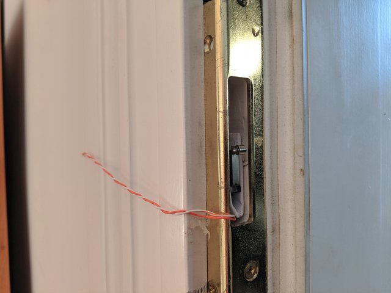

okupando 🚽🐼
=============

Single-page application with single-task focus -- checking if the toilet
is occupied or not.

Running
-------

You need to run it on Raspberry Pi.

After usual cloning and `npm install`ing, run
`npm start -- --gpio-channel GPIO`, where `GPIO` is Broadcom pin number
(BCM/GPIO) where you have your microswitch plugged in. You may use e.g.
`pinout` (from `python3-gpiozero`) to see the layout or visit
https://pinout.xyz/.

By default server will run with no HTTPS and push notifications,
run `npm start -- --help` to see how to configure those.

### Physical installation

Our microswitch is shoved in a hole in the wall where toilet door’s lock
slides in. It’s padded with some folded paper and kept in place with hot
glue.

If you don’t have a good place to put your Raspberry Pi next to your
toilet door, it may make sense to solder ethernet cable to your
microswitch and use ethernet sockets to connect it to your Pi.
Connection cannot go through the router, but ethernet switch is fine. If
that setup does not work, it may mean that distance between microswitch
and Pi is too great and signal fades. Experiment with that.

### Microswitch setup

As of now, GPIO channel is set up in INPUT mode with PULL UP and change
interval of 200ms.

Developing
----------

Running server with no `--gpio-channel` and `NODE_ENV=development` will
start debug mode when you can change status with keypresses.
Run `npm run dev` to run server that restarts on every file change.
No browser reload at this point, though.

Run `npm start -- --help` for all available options.

Contributing
------------

See our [contributing guidelines](./CONTRIBUTING.md).

Code of conduct
---------------

We have adapted [Contributor Covenant](./CODE_OF_CONDUCT.md) code of
conduct.

License
-------

Code licensed under [MIT](./LICENSE).

Graphics licensed under [Creative Commons BY-NC-SA](./LICENSE-CC-BY-NC-SA.md).
